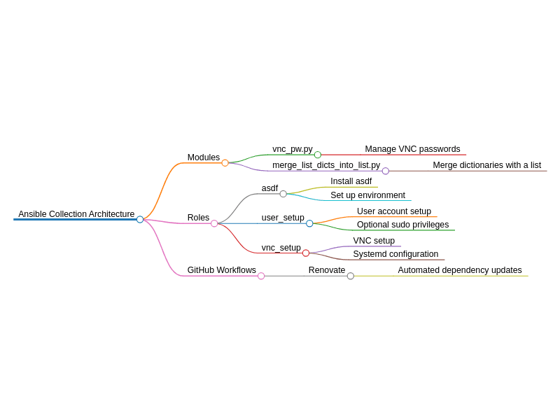

# Ansible Collection: CowDogMoo Workstation

[](https://github.com/CowDogMoo/ansible-collection-workstation/blob/main/LICENSE)
[](https://github.com/CowDogMoo/ansible-collection-workstation/actions/workflows/pre-commit.yaml)
[](https://github.com/CowDogMoo/ansible-collection-workstation/actions/workflows/molecule.yaml)
[](https://github.com/CowDogMoo/ansible-collection-workstation/actions/workflows/renovate.yaml)

This Ansible collection provides a comprehensive setup for my
workstation environment, covering various aspects, including user setup,
package management, ZSH configuration, VNC setup, ASDF version manager, and
various cybersecurity tools.

## Architecture Diagram



## Requirements

- Ansible 2.15 or higher

## Installation

Install latest version of the Workstation collection:

```bash
ansible-galaxy collection install git+https://github.com/CowDogMoo/ansible-collection-workstation.git,main
```

Alternatively, you can build the collection locally and install it from
the generated tarball:

```bash
ansible-galaxy collection build --force && \
  ansible-galaxy collection install cowdogmoo-workstation-*.tar.gz -p ~/.ansible/collections --force --pre
```

## Roles

### ASDF

Installs and configures [ASDF](https://asdf-vm.com/), a version manager for
multiple language runtimes.

### User Setup

Sets up user accounts with optional sudo privileges on Unix-like systems.

### Package Management

Manages package installations and cleanups on Debian-based and Red Hat-based systems.

### Zsh Setup

Installs and configures Zsh with Oh-My-Zsh, setting up a robust shell environment.

### VNC Setup

Configures VNC services for remote desktop access, including password
management and service setup.

### Logging

Creates logging directories and log rotation configurations for a provided path.

## Usage

Include the roles from this collection in your playbook. Here's an example:

```yaml
---
- name: Provision container
  hosts: localhost
  roles:
    - cowdogmoo.workstation.asdf
    - cowdogmoo.workstation.user_setup
    - cowdogmoo.workstation.package_management
    ...
```

## Development

### Release Process

For information on creating new releases of this collection, see our
[Release Process Documentation](docs/releases.md).

## License

This collection is licensed under the MIT License - see the [LICENSE](LICENSE)
file for details.

## Support

- Repository: [cowdogmoo/ansible-collection-workstation](http://github.com/CowDogMoo/ansible-collection-workstation)
- Issue Tracker: [GitHub Issues](https://github.com/CowDogMoo/ansible-collection-workstation/issues)

## Authors

- Jayson Grace ([techvomit.net](https://techvomit.net))
