# Ansible Collection: Arsenal

[](https://github.com/l50/ansible-collection-arsenal/blob/main/LICENSE)
[](https://github.com/l50/ansible-collection-arsenal/actions/workflows/pre-commit.yaml)
[](https://github.com/l50/ansible-collection-arsenal/actions/workflows/molecule.yaml)
[](https://github.com/l50/ansible-collection-arsenal/actions/workflows/renovate.yaml)

This Ansible collection provides offsec tools, configurations, and utilities
that I employ regularly.

## Architecture Diagram

```mermaid
graph TD
    Collection[Ansible Collection]
    Collection --> Roles[🎭 Roles]
    Roles --> R0[attack_box 🧪]
    Roles --> R1[sliver 🧪]
    Roles --> R2[ttpforge 🧪]
    Collection --> Playbooks[📚 Playbooks]
    Playbooks --> PB0[attack_box 🧪]
    Playbooks --> PB1[sliver 🧪]
    Playbooks --> PB2[atomic-red-team 🧪]
    Playbooks --> PB3[ttpforge 🧪]
```



## Requirements

- Ansible 2.15 or higher

## Installation

Install latest version of the Arsenal collection:

```bash
ansible-galaxy collection install git+https://github.com/l50/ansible-collection-arsenal.git,main
```

Alternatively, you can build the collection locally and install it from
the generated tarball:

```bash
ansible-galaxy collection build --force && \
  ansible-galaxy collection install l50-arsenal-*.tar.gz -p ~/.ansible/collections --force --pre
```

## Roles

### Sliver

Installs and configures [Sliver](https://github.com/BishopFox/sliver), a
cross-platform implant framework.

### TTPForge

Installs and configures [TTPForge](https://github.com/facebookincubator/TTPForge),
a Cybersecurity Framework for developing, automating, and executing attacker
Tactics, Techniques, and Procedures (TTPs).

### Attack Box

Creates an attack box for penetration testing and red teaming.

## Usage

Include the roles from this collection in your playbook. Here's an example:

```yaml
---
- name: Provision system
  hosts: localhost
  roles:
    - l50.arsenal.sliver
    - l50.arsenal.ttpforge
    - l50.arsenal.attack_box
```

## Development

### Setting Up Development Environment

To set up the development environment and install all required dependencies,
including docsible for automatic documentation generation:

```bash
python3 -m pip install -r .hooks/requirements.txt
```

### Documentation Generation

This project uses [docsible](https://github.com/docsible/docsible) to automatically
generate documentation for Ansible roles. Documentation is generated automatically
via pre-commit hooks when changes are made to role files.

## License

This collection is licensed under the MIT License - see the [LICENSE](LICENSE)
file for details.

## Support

- Repository: [l50/ansible-collection-arsenal](http://github.com/l50/ansible-collection-arsenal)
- Issue Tracker: [GitHub Issues](https://github.com/l50/ansible-collection-arsenal/issues)

## Authors

- Jayson Grace ([techvomit.net](https://techvomit.net))
