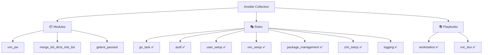

```mermaid
graph TD
    Collection[Ansible Collection]
    Collection --> Modules[📦 Modules]
    Modules --> M0[vnc_pw]
    Modules --> M1[merge_list_dicts_into_list]
    Modules --> M2[getent_passwd]
    Collection --> Roles[🎭 Roles]
    Roles --> R0[go_task ✅]
    Roles --> R1[asdf ✅]
    Roles --> R2[user_setup ✅]
    Roles --> R3[vnc_setup ✅]
    Roles --> R4[package_management ✅]
    Roles --> R5[zsh_setup ✅]
    Roles --> R6[logging ✅]
    Collection --> Playbooks[📚 Playbooks]
    Playbooks --> P0[workstation ✅]
    Playbooks --> P1[vnc_box ✅]
```
